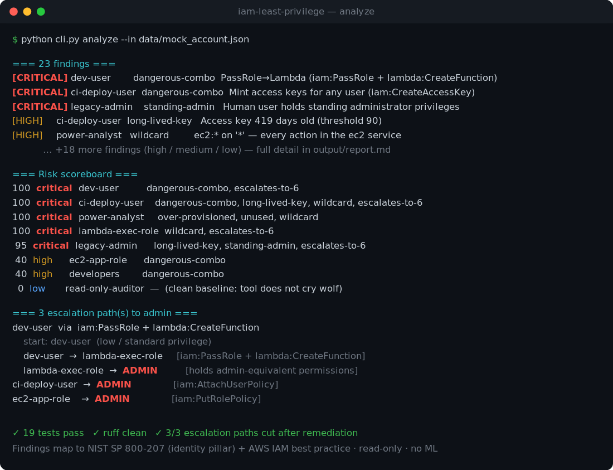
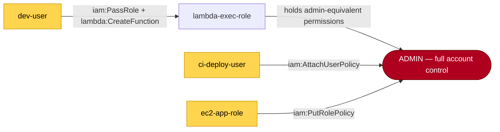

# AWS IAM Least-Privilege Analyzer

Ingests AWS IAM configuration, finds **over-provisioned access and privilege-escalation
paths**, and emits a **least-privilege remediation plan** — tightened IAM policy JSON you
could actually apply, with every finding traced to a named principle (NIST SP 800-207
identity pillar / AWS IAM best practice). Rules-based and explainable: **no ML, no black
box**.

> Parsing IAM JSON is table stakes. The point of this project is the reasoning on top —
> detecting dangerous access, computing **privilege-escalation paths**, and *proving* the
> recommended policy cuts an attacker's reach.

[](https://github.com/MetaMaaz/iam-least-privilege/actions/workflows/ci.yml)




---

## The headline artifact: before → after escalation paths

The analyzer models identities, assumable roles, and escalation grants as a directed graph
(the IAM analogue of a network attack-path; conceptually in
[BloodHound](https://github.com/BloodHoundAD/BloodHound) territory, cited as prior art). A
path to **ADMIN** is a concrete privilege-escalation chain.



A nominally low-privilege developer (`dev-user`) holds `iam:PassRole` + `lambda:CreateFunction`.
That lets them attach the over-powered `lambda-exec-role` (which has `iam:*`) to a function
they create and invoke — inheriting admin. The tool finds this chain, then **re-runs the
same graph computation against the remediated policies** and shows all three entry points
can no longer reach admin. See the full generated output in
[`output/report.md`](output/report.md).

---

## Quick start

```bash
pip install -r requirements.txt

# Full analysis on the bundled, deliberately-vulnerable mock account — zero AWS needed:
python cli.py report  --in data/mock_account.json --out output/

# Just the findings + escalation summary on stdout:
python cli.py analyze --in data/mock_account.json

# Real account (read-only): snapshot IAM, then analyze the export offline:
aws iam get-account-authorization-details > export.json
python cli.py ingest --export export.json --out inventory.json
python cli.py report --in inventory.json --out output/
```

Everything except `ingest --live` runs fully offline. The tool is **read-only** — it never
modifies IAM.

---

## What it detects

| Category | What it flags | Principle cited |
| --- | --- | --- |
| `wildcard` | `s3:*`, `Action: "*"`, `Resource: "*"` | AWS — grant least privilege, avoid wildcards |
| `over-provisioned` | broad grants exceeding demonstrated use | NIST 800-207 least privilege |
| `unused` | services granted but untouched for N days | NIST 800-207 least privilege |
| `dangerous-combo` | known priv-esc permission pairs | per-rule (Rhino Security Labs catalogue) |
| `standing-admin` | permanent admin on a human user | AWS — prefer roles + just-in-time |
| `long-lived-key` | access keys older than the threshold | AWS — prefer temporary role credentials |

Each finding rolls up into a **per-identity risk score** (severity weights + escalation
blast-radius), giving the report a sortable headline metric.

---

## Architecture

The non-negotiable design rule is a **hard separation between ingestion and reasoning**.
`ingestion.py` is the *only* module that knows anything about AWS; it produces a plain
`Inventory`. Everything interesting — classify, analyze, escalation, recommend — consumes
that structure and never calls AWS, so the whole engine is unit-testable offline against
mock policy JSON.

```
iam-least-privilege/
├── cli.py                  # ingest | analyze | report
├── analyzer/
│   ├── models.py           # Identity, Policy, Permission, Finding, EscalationPath, RiskScore
│   ├── ingestion.py        # AWS export / boto3 → Inventory   (ONLY AWS-facing module)
│   ├── classifier.py       # identity/permission → privilege tier + sensitivity   (pure)
│   ├── analyzer.py         # findings + risk scoring   (pure)
│   ├── escalation.py       # privilege-escalation path graph, before/after   (pure)
│   ├── recommender.py      # → tightened least-privilege policy JSON   (pure)
│   └── reporter.py         # → Markdown report + Mermaid diagram + policy export
├── data/
│   ├── sensitive_actions.yaml   # high-risk actions → sensitivity   (editable heuristics)
│   ├── escalation_rules.yaml    # known priv-esc permission combinations
│   └── mock_account.json        # hand-written vulnerable IAM setup for offline testing
├── ingest/
│   └── account_authorization_details.json   # redacted real-export sample
├── tests/                  # classifier / analyzer / escalation
└── output/                 # generated report + remediation policies (sample committed)
```

The heuristics live in **YAML, not code** (`data/*.yaml`), so every finding is easy to
defend and extend without touching Python.

**Data flow:** `ingestion` → `Inventory` → `classifier` annotates → `analyzer` produces
findings → `escalation` computes paths → `recommender` emits tightened policies →
`reporter` writes it all out.

---

## Testing with no infrastructure

IAM is config, not infrastructure — no VMs, no Docker. The hand-written
`data/mock_account.json` is a deliberately vulnerable account (a `*:*` user, a `PassRole`
developer, an unused power-user, long-lived keys) that exercises every code path. The unit
tests run the whole reasoning engine against it:

```bash
python -m pytest -q          # 19 tests: classifier, analyzer, escalation
ruff check analyzer cli.py   # lint
```

GitHub Actions runs both on every push across Python 3.10–3.12, plus a pipeline smoke test.

**Safety:** only ever point `--live` at a **read-only** AWS profile. Never commit real
account IDs, ARNs, or keys — `.gitignore` excludes `inventory.json` / exports; the
committed sample export is scrubbed to `000000000000`.

---

## Design principles

1. **Ingestion / reasoning separation** — all intelligence is testable offline.
2. **Rules-based and explainable** — every finding cites a named principle; defensibility
   over sophistication.
3. **Maps to a framework** — primarily NIST SP 800-207 (identity pillar), secondarily AWS
   IAM best practices.
4. **Read-only, always** — recommends; a human applies.

---

## Prior art & references

- Rhino Security Labs — *AWS IAM Privilege Escalation: Methods and Mitigation* (the
  escalation-technique catalogue this models).
- NIST SP 800-207 — *Zero Trust Architecture* (identity pillar: least privilege,
  per-request access).
- AWS — *Security best practices in IAM*.
- BloodHound — graph-based attack-path analysis for Active Directory (the conceptual
  lineage for the escalation graph).

*Companion project: a Network Segmentation Advisor (same discover → classify → recommend →
attack-path skeleton, network side). Together: containment of lateral movement from both
the identity and network angles.*
