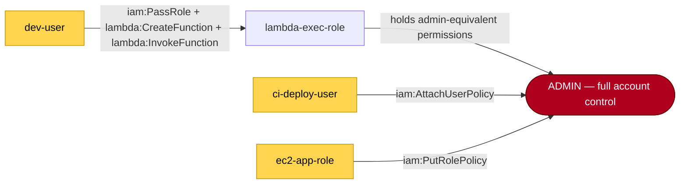

# IAM Least-Privilege Analysis Report

*Generated 2026-06-15 · account `REDACTED-MOCK`*

Findings map to **NIST SP 800-207** (Zero Trust Architecture — identity pillar: least privilege, per-request access) and **AWS IAM best practices**. Every finding cites the principle it violates. The tool is **read-only**; it recommends, a human applies.

## Executive summary

- **8** identities analysed (5 users, 2 roles, 1 groups).
- **23** findings — 7 critical, 12 high.
- **3** privilege-escalation path(s) to admin found; **3** cut by the recommended remediation.

## Risk scoreboard

Per-identity risk = Σ finding severity weights + escalation blast-radius bonus (capped 100).

| Identity | Risk | Band | Tier | Drivers |
| --- | --- | --- | --- | --- |
| dev-user | 100 | 🔴 critical | power | dangerous-combo, escalates-to-6 |
| ci-deploy-user | 100 | 🔴 critical | power | dangerous-combo, long-lived-key, wildcard, escalates-to-6 |
| power-analyst | 100 | 🔴 critical | power | over-provisioned, unused, wildcard |
| lambda-exec-role | 100 | 🔴 critical | admin | wildcard, escalates-to-6 |
| legacy-admin | 95 | 🔴 critical | admin | long-lived-key, standing-admin, escalates-to-6 |
| ec2-app-role | 40 | 🟠 high | standard | dangerous-combo |
| developers | 40 | 🟠 high | standard | dangerous-combo |
| read-only-auditor | 0 | 🔵 low | standard | — |

## Privilege-escalation paths (before → after)

Identities, assumable roles and escalation grants modelled as a graph (the IAM analogue of a network attack-path; conceptually in [BloodHound](https://github.com/BloodHoundAD/BloodHound) territory, cited as prior art). A path to **ADMIN** is a concrete escalation chain.



### `dev-user` → admin — ✅ **CUT** by remediation

*Technique:* iam:PassRole + lambda:CreateFunction + lambda:InvokeFunction

- `start: dev-user (low/standard privilege)`
- `dev-user --[iam:PassRole + lambda:CreateFunction + lambda:InvokeFunction]--> lambda-exec-role`
- `lambda-exec-role --[holds admin-equivalent permissions]--> admin (arbitrary privilege)`

### `ci-deploy-user` → admin — ✅ **CUT** by remediation

*Technique:* iam:AttachUserPolicy

- `start: ci-deploy-user (low/standard privilege)`
- `ci-deploy-user --[iam:AttachUserPolicy]--> admin (arbitrary privilege)`

### `ec2-app-role` → admin — ✅ **CUT** by remediation

*Technique:* iam:PutRolePolicy

- `start: ec2-app-role (low/standard privilege)`
- `ec2-app-role --[iam:PutRolePolicy]--> admin (arbitrary privilege)`

After applying the recommended policies, **0** escalation path(s) remain — the low-privilege entry points above can no longer reach admin.

## Findings

### 🔴 Critical (7)

**`ci-deploy-user` — dangerous-combo**

- Holds the 'Attach managed admin policy to self' escalation pattern (iam:AttachUserPolicy). self_attach_user_policy.
- *Principle:* NIST SP 800-207 (least privilege). AWS IAM best practice: do not grant iam:Attach* broadly.
- *Fix:* Remove iam:AttachUserPolicy or apply a permissions boundary capping the effective grant.

**`ci-deploy-user` — dangerous-combo**

- Holds the 'Mint access keys for another user' escalation pattern (iam:CreateAccessKey on another user). create_access_key.
- *Principle:* NIST SP 800-207 (least privilege). AWS: iam:CreateAccessKey on '*' lets one identity impersonate any user.
- *Fix:* Scope iam:CreateAccessKey to the principal's own user ARN (${aws:username}).

**`dev-user` — dangerous-combo**

- Holds the 'PassRole into a Lambda function' escalation pattern (iam:PassRole + lambda:CreateFunction + lambda:InvokeFunction). passrole_lambda.
- *Principle:* AWS IAM best practice: scope iam:PassRole to specific role ARNs. NIST SP 800-207: per-request, least-privilege access.
- *Fix:* Constrain iam:PassRole to a Resource ARN list that excludes privileged roles; the dev identity then cannot pass lambda-exec-role.

**`dev-user` — dangerous-combo**

- Holds the 'Assume a more-privileged role' escalation pattern (sts:AssumeRole). assume_role_chain.
- *Principle:* NIST SP 800-207: every access request evaluated per-request. Broad sts:AssumeRole defeats role separation.
- *Fix:* Scope sts:AssumeRole to an explicit allow-list of role ARNs; remove Resource '*'.

**`developers` — dangerous-combo**

- Holds the 'Assume a more-privileged role' escalation pattern (sts:AssumeRole). assume_role_chain.
- *Principle:* NIST SP 800-207: every access request evaluated per-request. Broad sts:AssumeRole defeats role separation.
- *Fix:* Scope sts:AssumeRole to an explicit allow-list of role ARNs; remove Resource '*'.

**`ec2-app-role` — dangerous-combo**

- Holds the 'Grant self via inline role policy' escalation pattern (iam:PutRolePolicy). self_put_role_policy.
- *Principle:* NIST SP 800-207 (least privilege). A role that can edit its own policy is unbounded.
- *Fix:* Remove iam:PutRolePolicy or scope the Resource to roles other than self, under a permissions boundary.

**`legacy-admin` — standing-admin**

- Human user 'legacy-admin' holds standing administrator privileges (tier: admin). Compromise of this single principal is full account takeover.
- *Principle:* AWS IAM best practice — avoid standing admin on humans; use roles + just-in-time elevation.
- *Fix:* Replace standing admin with a role assumed just-in-time (with MFA), so admin rights exist only during an active task.

### 🟠 High (12)

**`ci-deploy-user` — long-lived-key**

- Access key is 419 days old (threshold 90). Long-lived keys are a standing credential an attacker can exfiltrate and reuse.
- *Principle:* AWS IAM best practice — prefer temporary role credentials over long-lived access keys.
- *Fix:* Rotate or retire the key; migrate the workload to role assumption (IAM Roles Anywhere / OIDC for CI).

**`ci-deploy-user` — wildcard**

- Policy grants wildcard action 'cloudformation:*' on resource '*'. The identity can perform every action in the cloudformation service.
- *Principle:* AWS IAM best practice — grant least privilege; avoid Action/Resource wildcards.
- *Fix:* Replace 'cloudformation:*' with the specific cloudformation actions actually used, and scope the resource to specific ARNs.

**`ci-deploy-user` — wildcard**

- Policy grants wildcard action 's3:*' on resource '*'. The identity can perform every action in the s3 service.
- *Principle:* AWS IAM best practice — grant least privilege; avoid Action/Resource wildcards.
- *Fix:* Replace 's3:*' with the specific s3 actions actually used, and scope the resource to specific ARNs.

**`lambda-exec-role` — wildcard**

- Policy grants wildcard action 'iam:*' on resource '*'. The identity can perform every action in the iam service.
- *Principle:* AWS IAM best practice — grant least privilege; avoid Action/Resource wildcards.
- *Fix:* Replace 'iam:*' with the specific iam actions actually used, and scope the resource to specific ARNs.

**`lambda-exec-role` — wildcard**

- Policy grants wildcard action 's3:*' on resource '*'. The identity can perform every action in the s3 service.
- *Principle:* AWS IAM best practice — grant least privilege; avoid Action/Resource wildcards.
- *Fix:* Replace 's3:*' with the specific s3 actions actually used, and scope the resource to specific ARNs.

**`lambda-exec-role` — wildcard**

- Policy grants wildcard action 'dynamodb:*' on resource '*'. The identity can perform every action in the dynamodb service.
- *Principle:* AWS IAM best practice — grant least privilege; avoid Action/Resource wildcards.
- *Fix:* Replace 'dynamodb:*' with the specific dynamodb actions actually used, and scope the resource to specific ARNs.

**`legacy-admin` — long-lived-key**

- Access key is 612 days old (threshold 90). Long-lived keys are a standing credential an attacker can exfiltrate and reuse.
- *Principle:* AWS IAM best practice — prefer temporary role credentials over long-lived access keys.
- *Fix:* Rotate or retire the key; migrate the workload to role assumption (IAM Roles Anywhere / OIDC for CI).

**`power-analyst` — wildcard**

- Policy grants wildcard action 's3:*' on resource '*'. The identity can perform every action in the s3 service.
- *Principle:* AWS IAM best practice — grant least privilege; avoid Action/Resource wildcards.
- *Fix:* Replace 's3:*' with the specific s3 actions actually used, and scope the resource to specific ARNs.

**`power-analyst` — wildcard**

- Policy grants wildcard action 'athena:*' on resource '*'. The identity can perform every action in the athena service.
- *Principle:* AWS IAM best practice — grant least privilege; avoid Action/Resource wildcards.
- *Fix:* Replace 'athena:*' with the specific athena actions actually used, and scope the resource to specific ARNs.

**`power-analyst` — wildcard**

- Policy grants wildcard action 'ec2:*' on resource '*'. The identity can perform every action in the ec2 service.
- *Principle:* AWS IAM best practice — grant least privilege; avoid Action/Resource wildcards.
- *Fix:* Replace 'ec2:*' with the specific ec2 actions actually used, and scope the resource to specific ARNs.

**`power-analyst` — wildcard**

- Policy grants wildcard action 'rds:*' on resource '*'. The identity can perform every action in the rds service.
- *Principle:* AWS IAM best practice — grant least privilege; avoid Action/Resource wildcards.
- *Fix:* Replace 'rds:*' with the specific rds actions actually used, and scope the resource to specific ARNs.

**`power-analyst` — wildcard**

- Policy grants wildcard action 'glue:*' on resource '*'. The identity can perform every action in the glue service.
- *Principle:* AWS IAM best practice — grant least privilege; avoid Action/Resource wildcards.
- *Fix:* Replace 'glue:*' with the specific glue actions actually used, and scope the resource to specific ARNs.

### 🟡 Medium (2)

**`power-analyst` — over-provisioned**

- Holds broad 'ec2:*' but last used the ec2 service 130 days ago — the grant far exceeds demonstrated need.
- *Principle:* NIST SP 800-207 §2.1 (tenet 6, per-request access) & identity pillar — grant the minimum privilege required, re-evaluated per request.
- *Fix:* Remove ec2 access, or downscope to the handful of read actions usage history shows are needed.

**`power-analyst` — over-provisioned**

- Holds broad 'rds:*' but last used the rds service 160 days ago — the grant far exceeds demonstrated need.
- *Principle:* NIST SP 800-207 §2.1 (tenet 6, per-request access) & identity pillar — grant the minimum privilege required, re-evaluated per request.
- *Fix:* Remove rds access, or downscope to the handful of read actions usage history shows are needed.

### 🔵 Low (2)

**`power-analyst` — unused**

- Access to the ec2 service is granted but unused for 130 days (threshold 90).
- *Principle:* NIST SP 800-207 §2.1 (tenet 6, per-request access) & identity pillar — grant the minimum privilege required, re-evaluated per request.
- *Fix:* Revoke ec2 access; re-grant on demand if needed.

**`power-analyst` — unused**

- Access to the rds service is granted but unused for 160 days (threshold 90).
- *Principle:* NIST SP 800-207 §2.1 (tenet 6, per-request access) & identity pillar — grant the minimum privilege required, re-evaluated per request.
- *Fix:* Revoke rds access; re-grant on demand if needed.

## Recommended least-privilege policies

Valid AWS policy documents written to `output/policies/`. Each is the tightened replacement for the identity's current grants.

### `legacy-admin`

- Removed '*:*' admin grant; reconstructed minimal read access for services actually used (ec2, iam, s3). Confirm write needs explicitly.

```json
{
  "Version": "2012-10-17",
  "Statement": []
}
```

### `dev-user`

- Scoped 'iam:PassRole' from '*' to a single non-privileged role ARN with a PassedToService condition — cuts the PassRole escalation edge.

```json
{
  "Version": "2012-10-17",
  "Statement": [
    {
      "Effect": "Allow",
      "Action": "lambda:CreateFunction",
      "Resource": "*"
    },
    {
      "Effect": "Allow",
      "Action": "lambda:InvokeFunction",
      "Resource": "*"
    },
    {
      "Effect": "Allow",
      "Action": "lambda:UpdateFunctionCode",
      "Resource": "*"
    },
    {
      "Effect": "Allow",
      "Action": "iam:PassRole",
      "Resource": "arn:aws:iam::ACCOUNT_ID:role/app-runtime-nonprivileged",
      "Condition": {
        "StringEquals": {
          "iam:PassedToService": "lambda.amazonaws.com"
        }
      }
    },
    {
      "Effect": "Allow",
      "Action": "logs:CreateLogGroup",
      "Resource": "*"
    },
    {
      "Effect": "Allow",
      "Action": "s3:GetObject",
      "Resource": "arn:aws:s3:::app-artifacts/*"
    }
  ]
}
```

### `ci-deploy-user`

- Removed identity-write action 'iam:CreateAccessKey' (self-escalation primitive); route privileged IAM changes through change-management.
- Removed identity-write action 'iam:AttachUserPolicy' (self-escalation primitive); route privileged IAM changes through change-management.
- Replaced wildcard 'cloudformation:*' with read-only cloudformation:Get*/List*/Describe* (confirm any write actions needed).
- Replaced wildcard 's3:*' with read-only s3:Get*/List*/Describe* (confirm any write actions needed).

```json
{
  "Version": "2012-10-17",
  "Statement": [
    {
      "Effect": "Allow",
      "Action": "cloudformation:Get*",
      "Resource": "*"
    },
    {
      "Effect": "Allow",
      "Action": "cloudformation:List*",
      "Resource": "*"
    },
    {
      "Effect": "Allow",
      "Action": "cloudformation:Describe*",
      "Resource": "*"
    },
    {
      "Effect": "Allow",
      "Action": "s3:Get*",
      "Resource": "*"
    },
    {
      "Effect": "Allow",
      "Action": "s3:List*",
      "Resource": "*"
    },
    {
      "Effect": "Allow",
      "Action": "s3:Describe*",
      "Resource": "*"
    }
  ]
}
```

### `power-analyst`

- Replaced wildcard 's3:*' with read-only s3:Get*/List*/Describe* (confirm any write actions needed).
- Replaced wildcard 'athena:*' with read-only athena:Get*/List*/Describe* (confirm any write actions needed).
- Dropped 'ec2:*' — ec2 unused for 130 days.
- Dropped 'rds:*' — rds unused for 160 days.
- Replaced wildcard 'glue:*' with read-only glue:Get*/List*/Describe* (confirm any write actions needed).

```json
{
  "Version": "2012-10-17",
  "Statement": [
    {
      "Effect": "Allow",
      "Action": "s3:Get*",
      "Resource": "*"
    },
    {
      "Effect": "Allow",
      "Action": "s3:List*",
      "Resource": "*"
    },
    {
      "Effect": "Allow",
      "Action": "s3:Describe*",
      "Resource": "*"
    },
    {
      "Effect": "Allow",
      "Action": "athena:Get*",
      "Resource": "*"
    },
    {
      "Effect": "Allow",
      "Action": "athena:List*",
      "Resource": "*"
    },
    {
      "Effect": "Allow",
      "Action": "athena:Describe*",
      "Resource": "*"
    },
    {
      "Effect": "Allow",
      "Action": "glue:Get*",
      "Resource": "*"
    },
    {
      "Effect": "Allow",
      "Action": "glue:List*",
      "Resource": "*"
    },
    {
      "Effect": "Allow",
      "Action": "glue:Describe*",
      "Resource": "*"
    }
  ]
}
```

### `lambda-exec-role`

- Scoped 'iam:PassRole' from '*' to a single non-privileged role ARN with a PassedToService condition — cuts the PassRole escalation edge.
- Replaced wildcard 's3:*' with read-only s3:Get*/List*/Describe* (confirm any write actions needed).
- Replaced wildcard 'dynamodb:*' with read-only dynamodb:Get*/List*/Describe* (confirm any write actions needed).

```json
{
  "Version": "2012-10-17",
  "Statement": [
    {
      "Effect": "Allow",
      "Action": "iam:PassRole",
      "Resource": "arn:aws:iam::ACCOUNT_ID:role/app-runtime-nonprivileged",
      "Condition": {
        "StringEquals": {
          "iam:PassedToService": "lambda.amazonaws.com"
        }
      }
    },
    {
      "Effect": "Allow",
      "Action": "s3:Get*",
      "Resource": "*"
    },
    {
      "Effect": "Allow",
      "Action": "s3:List*",
      "Resource": "*"
    },
    {
      "Effect": "Allow",
      "Action": "s3:Describe*",
      "Resource": "*"
    },
    {
      "Effect": "Allow",
      "Action": "dynamodb:Get*",
      "Resource": "*"
    },
    {
      "Effect": "Allow",
      "Action": "dynamodb:List*",
      "Resource": "*"
    },
    {
      "Effect": "Allow",
      "Action": "dynamodb:Describe*",
      "Resource": "*"
    },
    {
      "Effect": "Allow",
      "Action": "logs:CreateLogStream",
      "Resource": "*"
    }
  ]
}
```

### `ec2-app-role`

- Removed identity-write action 'iam:PutRolePolicy' (self-escalation primitive); route privileged IAM changes through change-management.

```json
{
  "Version": "2012-10-17",
  "Statement": [
    {
      "Effect": "Allow",
      "Action": "s3:GetObject",
      "Resource": "arn:aws:s3:::app-config/*"
    },
    {
      "Effect": "Allow",
      "Action": "sqs:SendMessage",
      "Resource": "*"
    }
  ]
}
```

### `developers`

- Scoped 'sts:AssumeRole' from '*' to an explicit role allow-list.

```json
{
  "Version": "2012-10-17",
  "Statement": [
    {
      "Effect": "Allow",
      "Action": "sts:AssumeRole",
      "Resource": "arn:aws:iam::ACCOUNT_ID:role/scoped-task-role"
    },
    {
      "Effect": "Allow",
      "Action": "cloudwatch:GetMetricData",
      "Resource": "*"
    },
    {
      "Effect": "Allow",
      "Action": "logs:FilterLogEvents",
      "Resource": "*"
    }
  ]
}
```

---

*Generated by the IAM Least-Privilege Analyzer. Rules-based and explainable — no ML. Heuristics live in `data/*.yaml`.*